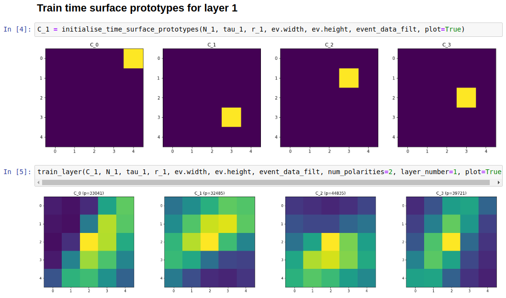
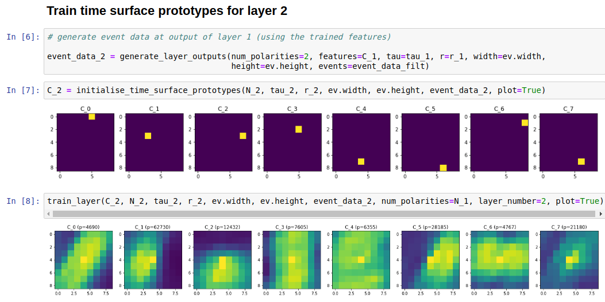
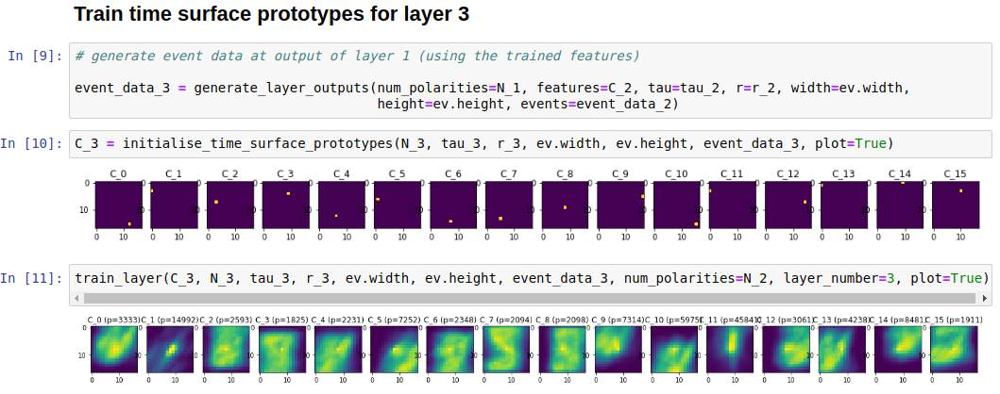

# README

## Overview

In order to familiarise myself with event-based cameras I implemented [[1]](#1), in which "time surfaces" are generated in real-time from event camera feeds. Digits are classified by building time surfaces of each digit.

## References
<a id="1">[1]</a> 
Lagorce X, Orchard G, Galluppi F, Shi BE, Benosman RB. HOTS: A Hierarchy of Event-Based Time-Surfaces for Pattern Recognition. *IEEE Trans Pattern Anal Mach Intell*. 2017;39(7):1346‐1359. doi:10.1109/TPAMI.2016.2574707

## Setup

Download the event-Python library from Github:

~~~
git clone https://github.com/gorchard/event-Python.git event_Python
touch event_Python/__init__.py
~~~

Install dependencies:
~~~
conda env create -f environment.yaml
~~~

Download the N-MNIST dataset from *https://www.garrickorchard.com/datasets/n-mnist* and place in *./datasets/mnist/*

## Train and visualise results

Run the Jupyter Notebook to train and visualise the digit classification:
~~~
jupyter notebook train_and_test_hots_model.ipynb
~~~

The training results for each of the layers will be shown. Here are screenshots from each of the layers:

### Time surface prototypes for layer 1

### Time surface prototypes for layer 2

### Time surface prototypes for layer 3

